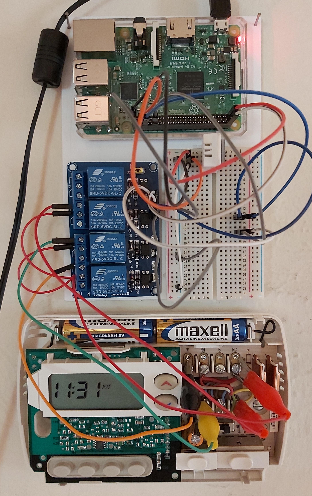
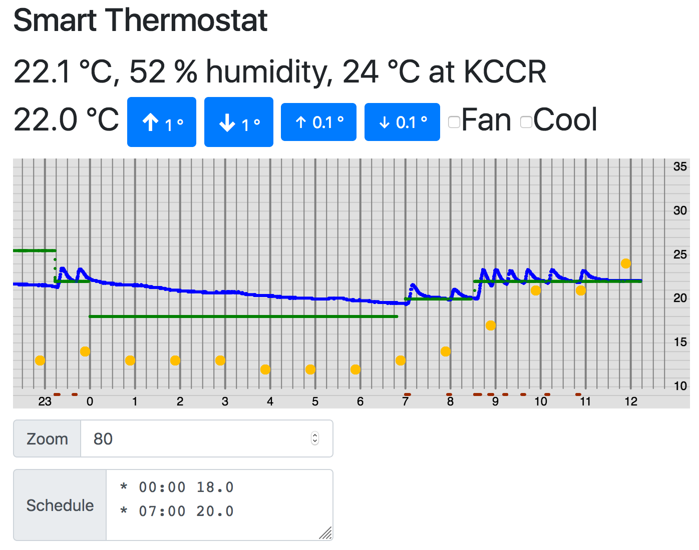
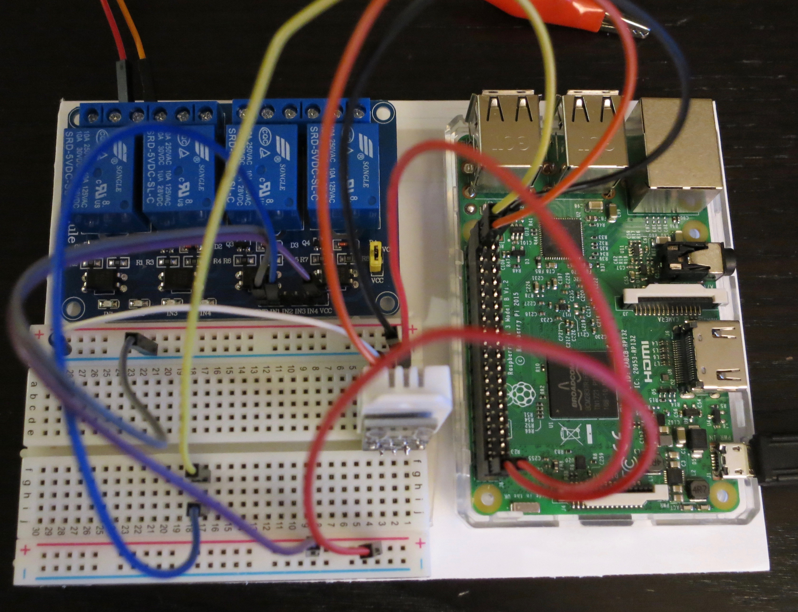

# smart-thermostat
A smart thermostat project, under development.

## Raspberry Pi Web App Version

### Hardware and Web App on Hand Computer

### Screen Shot from Browser

### Closer Look at Wiring

See the main branch for the code.

## Circuit Python and the Circuit Playground Express Version

See the cpx branch for the code.

